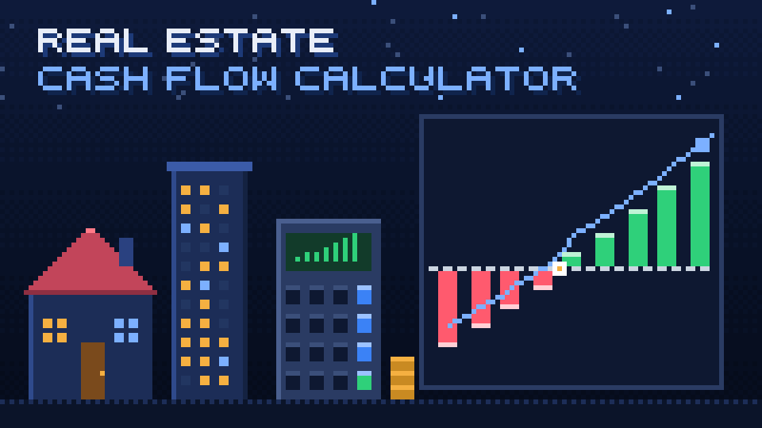

# property-mortgage-comparator

Interactive single-file dashboard (`index.html`) to compare a property at its asking price vs a negotiated price in Abu Dhabi: mortgage, fees, cash-flow, break-even, rate stress, sensitivity and savings opportunity cost.

**Live:** https://ovmelo03031.github.io/property-mortgage-comparator/

Open `index.html` in a browser. Inputs persist in `localStorage` when available.

Calculation check (no dependencies): `node tests/check.js`

## License

[MIT](LICENSE)
